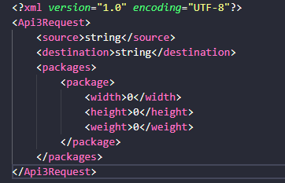

# At-Home Project: Requesting multiple API

## Backend built With

- [NetCore](https://docs.microsoft.com/en-us/dotnet/) - The webapi framework used
- [Swagger](https://swagger.io/) - Documentation generator
- [ProblemDetails](https://github.com/khellang/Middleware) - Error handling
- [In-Memory Database](https://github.com/aspnet/EntityFrameworkCore) - In-memory database
- [Autofac](https://autofac.org/) - Dependency injection
- [Serilog](https://serilog.net/) - Logging
- [FluentValidation](https://fluentvalidation.net/) - Object validation

### Documentation

For testing purposes, you can use the following url: [Swagger-UI](https://localhost:5001/index.html)

There are some users account for retrieve information from the API:

For API1:

```json
 {
  "userName": "user1",
  "password": "admin1"
}
````

For API2:

```json
 {
  "userName": "user2",
  "password": "admin2"
}
````

For XML:

```json
 {
  "userName": "user3",
  "password": "admin3"
}
````

#### NOTICE:

In swagger for some reasons there is a mistake while trying to execute the request because the example model is wrong,
so here there is an example of the xml schema need it to use the endpoint.


